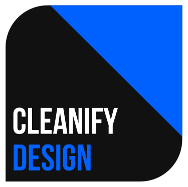

<div align=center>

</div>

HTML, CSS & JS personal framework.

The framework is based in "One UI" of Samsung and organization of Bootstrap.

# Features

- Dark mode
- Use of HTML5 tags
- Mobile ready

# Get started

Compile CSS & JS
```
yarn run dist
```

Watch changes
```
yarn start
```
---

Watch docs
```
yarn run docs-watch
```

Compile docs
```
yarn run build
```

---

You can download, also, from GitHub [releases](https://github.com/SavanDev/cleanify-design/releases).
